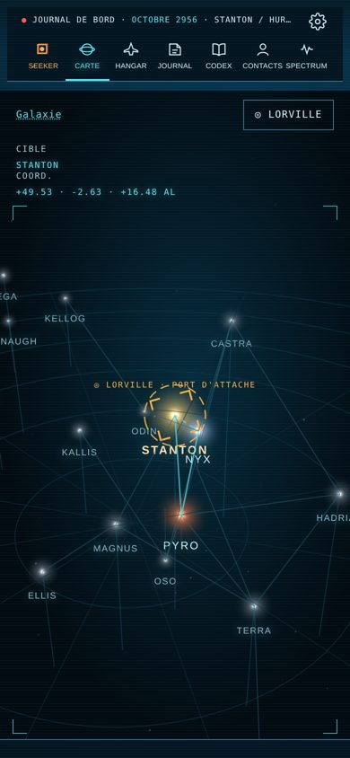
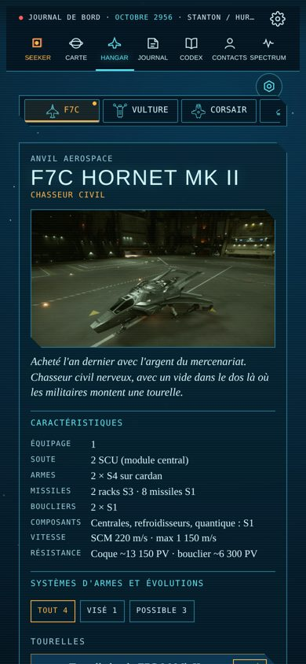
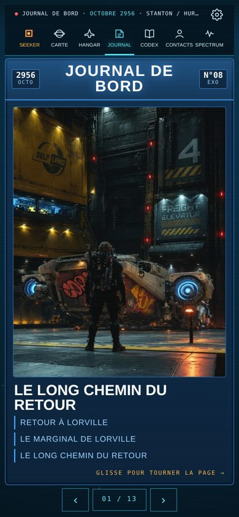

# mobiGlas

**Le journal de bord d'Exo, pilote de Star Citizen, dans une appli pour téléphone.**
Carte de l'univers, hangar de la flotte, journal illustré, Codex de 1 480 fiches (Galactapedia), et Seeker, l'IA de bord qui écoute, répond et commente la partie en direct.

### ▶ [Ouvrir l'appli](https://exo7-seeker.github.io/Mobiglas/) · 📄 [Guide d'installation (PDF)](docs/mobiGlas-1.0-guide.pdf)

<p>
  
  
  
</p>

---

## Installer en 30 secondes

1. Sur ton téléphone, ouvre **[exo7-seeker.github.io/Mobiglas](https://exo7-seeker.github.io/Mobiglas/)** dans Chrome.
2. Menu **⋮** → **Ajouter à l'écran d'accueil**. Sur iPhone : Safari → **Partager** → **Sur l'écran d'accueil**.
3. Ouvre mobiGlas depuis l'icône. Les réglages sont derrière la **roue dentée** en haut à droite.

L'appli se met à jour toute seule.

## Ce qu'il y a dedans

| Onglet | Contenu |
|---|---|
| **Seeker** | L'IA de bord, dans un cockpit 3D en relief (fichier de cabines à ajouter, voir le guide). |
| **Carte** | Systèmes, planètes, stations et routes de l'univers. |
| **Hangar** | La flotte d'Exo, avec hologrammes 3D (fichiers `.holo` à ajouter). |
| **Journal** | Le récit d'Exo, mis en page comme un magazine. |
| **Codex** | La Galactapedia en français, avec recherche. |
| **Contacts · Spectrum** | Les personnages croisés et les nouvelles de l'univers. |

Le **guide PDF** explique pas à pas : installer l'appli, ajouter les cockpits 3D (`.cockpit3d`) et les hologrammes (`.holo`), relier Star Citizen depuis le PC, et faire parler Seeker.

## Appli fond d'écran Android

Un fond d'écran animé en relief qui rejoue les scènes `.cockpit3d` (bouge avec le téléphone) :
**[télécharger l'APK](https://exo7-seeker.github.io/Mobiglas/fond3d.apk)** (ou la [version .zip](https://exo7-seeker.github.io/Mobiglas/fond3d.zip) si Chrome bloque le fichier).

## Vie privée et sécurité

- Tout ce que tu ajoutes reste **dans ton téléphone** : cockpits, hologrammes, notes, clé Seeker, code de liaison. Rien n'est envoyé ici.
- Les fichiers `.cockpit3d` et `.holo` et le script PC ne sont **pas** dans ce dépôt : ils se transmettent directement, de personne à personne.
- Seeker utilise **ta propre** clé Claude ; mets un plafond de dépense mensuel dans la console Anthropic.

## Organisation du dépôt

```
index.html, sw.js, manifest.webmanifest   l'appli (servie telle quelle par GitHub Pages)
data.json, galactapedia-fr.json            contenus : journal de base, Codex
*.webp, icon-*.png, logo.svg               images de l'appli
fond3d.apk, fond3d.zip                     appli fond d'écran (lien direct)
android-wallpaper/                         code de l'appli fond d'écran
docs/                                      guide PDF et captures
outils/                                    outil d'export de la Galactapedia
```

---

<sub>mobiGlas 1.0 · 10/10/2026 · Projet de fan, non affilié à Cloud Imperium Games. Star Citizen® est une marque de Cloud Imperium Rights LLC.</sub>
